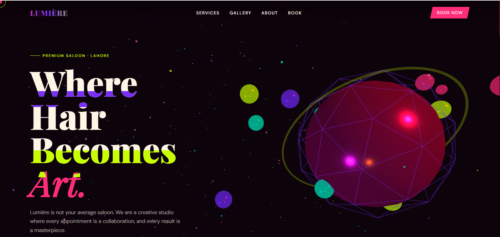
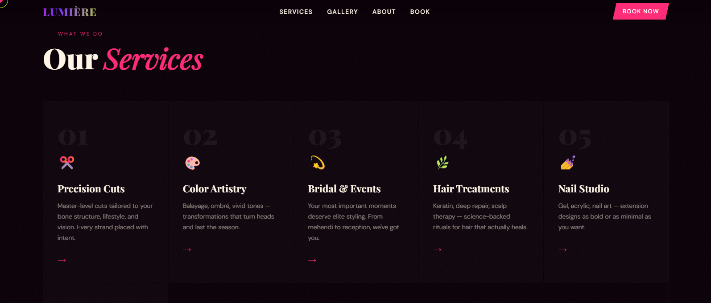
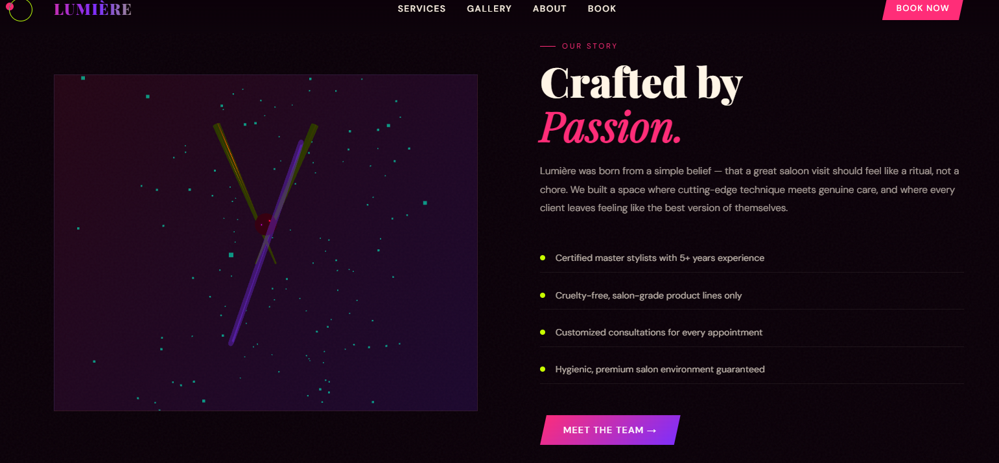
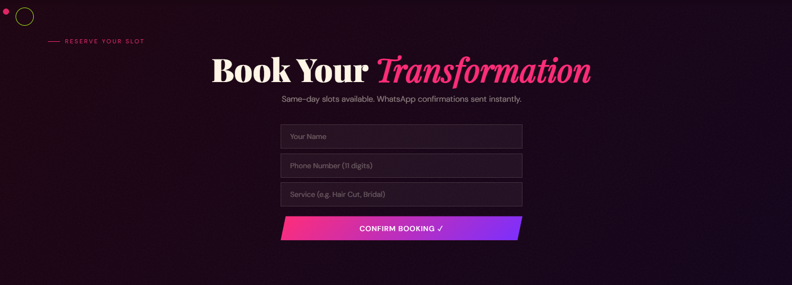

# ✂️ Lumière , Premium Saloon Landing Page
 
A salon landing page built with **React + Three.js**, featuring an interactive 3D hero, glitch typography, custom cursor, and a working booking form.
 

 
## 🌐 Live Demo
**[salonlumiere.netlify.app](https://salonlumiere.netlify.app)**
 
---
 
## 📸 Screenshots
 
| Hero — Three.js 3D Scene | Services Grid |
|---|---|
|  |  |
 
| About Section | Booking Form |
|---|---|
|  |  |
 
---
 
## ✨ What's Built
 
- **Three.js 3D Hero** — Icosahedron with orbiting spheres, particle system, and mouse parallax
- **Glitch Typography** — CSS `clip-path` glitch effect on hero heading
- **Custom Cursor** — Dot + ring cursor with `mix-blend-mode: difference`
- **Responsive Design** — Hamburger menu, adaptive grid, mobile-first breakpoints
- **Booking Form** — Client-side validation + Formspree API integration
- **CSS Animations** — `fadeUp`, `gradShift`, `floatY`, `lineSlide` keyframes
- **Noise Texture** — SVG fractal noise overlay for depth
 
---
 
## 🛠️ Tech Stack
 
| | Technology |
|---|---|
| Framework | React 18 |
| 3D Graphics | Three.js (r128) |
| Build Tool | Vite |
| Form Backend | Formspree |
| Fonts | Playfair Display + DM Sans |
| Deployment | Netlify |
 
---
 
## 🚀 Run Locally
 
```bash
git clone https://github.com/ifra489/lumiere-saloon.git
cd lumiere-saloon
npm install
npm run dev
```
 
Add videos to `/public/video/` folder:
```
public/
└── video/
    ├── b.mp4
    ├── c.mp4
    └── WhatsApp.mp4
```
 
---
 
## 👩‍💻 Author
 
**Ifra** — Frontend Developer
 
[](https://github.com/ifra489)
[](www.linkedin.com/in/ifra-malik-09236836a)
[](https://salonlumiere.netlify.app)
